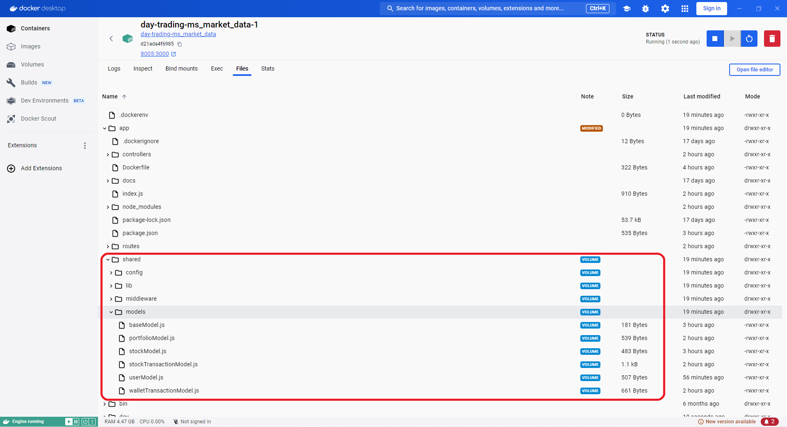

### Add the shared code volume to your service

1. Update your service definition in the docker-compose.yaml
```yml
depends_on:
      - ms_shared
    volumes:
      - shared_volume:/app/shared
```

2. shared_volume will now be mounted inside the working directory of your micrsoservice. Update any paths to the shared code in your microservice. For example from ms_market_data: 
```javascript
  const Stock = require('../shared/models/stockModel');
```

```javascript
  const { validate } = require('../../shared/middleware/base.validation');
```

3. If any code in the shared microservices changes run `docker compose down -v` to reset the shared_volume between sessions.

You can check the shared volume is mounted correctly by going to the files tab in docker desktop.


